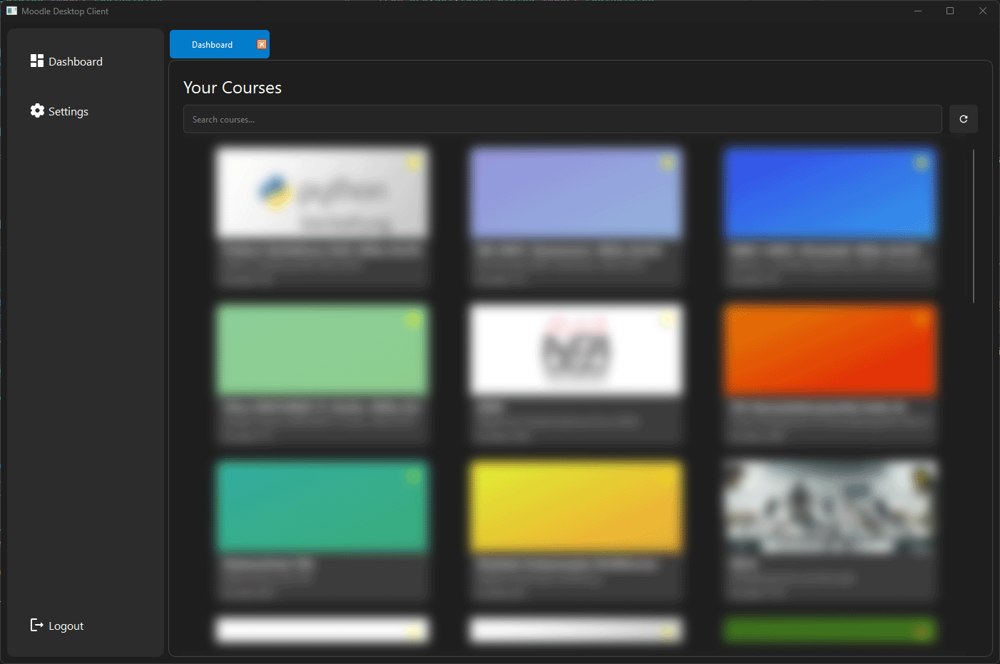

# Koodle

A gui wrapper around my moodle rest api with some basic features:

- See all Courses
- Mark courses as favourites
- See downloadable content from each course and download/ copy the url

> The programm is currently in development, not even beta state

## Setup

Please change the [Moodle URL](main.py#31) to your given Moodle instance.

```python
moodle_api = MoodleAPI("https://instance.domain.com/")
```

## Screenshots

